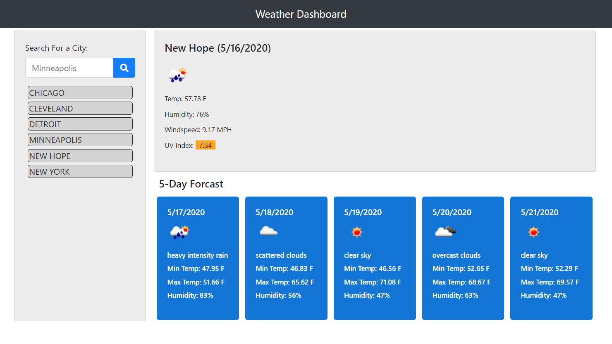

# WeatherDashboard
[](WeatherDashboard)

## Description
The application is a weather dashboard runs in the browser and features dynamically updated HTML and CSS.  It utilizes Third-party APIs from OpenWeather.com to access current and forecasted weather information. The app utilizes APIs to make requests with specific parameters to a URL. 

https://ttanner44.github.io/WeatherDashboard/


## Table of Contents
* [Usage](#Usage)
* [User Story](#User-Story)
* [Acceptance Criteria](#Acceptance-Criteria)
* [Installation](#installation)
* [License](#License)
* [Contributing](#Contributing)
* [Tests](#Tests)
* [Questions](#Questions)

  
## Usage
Upon entry into the app, the users current location is presented with current and forecasted weather conditions. The user has the option to search the conditions of other locations if desired. The other locations are stored (via local storage) and rendered back to the user for future use. The application will display current weather and five days of forecast.

## User Story

```
AS A traveler
I WANT to see the weather outlook for multiple cities
SO THAT I can plan a trip accordingly
```

## Acceptance Criteria

```
GIVEN a weather dashboard with form inputs
WHEN I search for a city
THEN I am presented with current and future conditions for that city and that city is added to the search history
WHEN I view current weather conditions for that city
THEN I am presented with the city name, the date, an icon representation of weather conditions, the temperature, the humidity, the wind speed, and the UV index
WHEN I view the UV index
THEN I am presented with a color that indicates whether the conditions are favorable, moderate, or severe
WHEN I view future weather conditions for that city
THEN I am presented with a 5-day forecast that displays the date, an icon representation of weather conditions, the temperature, and the humidity
WHEN I click on a city in the search history
THEN I am again presented with current and future conditions for that city
WHEN I open the weather dashboard
THEN I am presented with the last searched city forecast
```

The following image demonstrates the application functionality:




  ## Installation
  To install necessary dependencies, run the following command:
  Runs in browser 
  
  ## License
  This project is licensed under the  MIT license.
  
  ## Contributing
  Contributions are welcome.
  
  ## Tests
  To run tests, run the following command:
  n/a
  
  ## Questions
  
  If you have any quetions about the repo, open an issue or contact  directaly at timtanner@tanner-companies.com.
  
